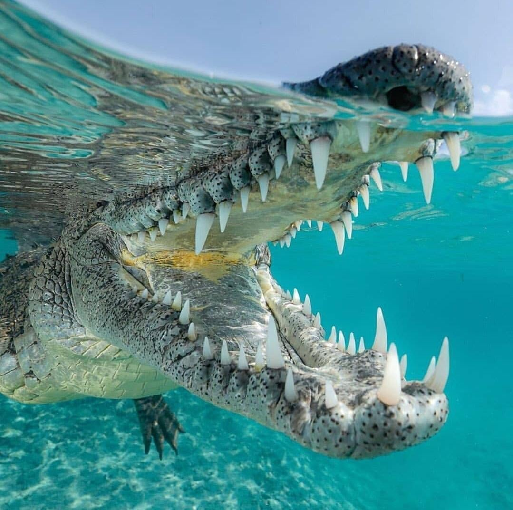

# Welcome

<!-- PROJECT LOGO -->
 

  

## TODO
- [ ] requirements.txt
- [ ] python environment (python 3.10?), set up mamba over conda
- [ ] cookie cutter file format
- [ ] setup instructions, download data instructions, etc
- [ ] notebooks for testing, %autoreload
- [ ] models folder: predictions, training log, model config, eval stats
- [ ] fnpg command line for manipulating audio and video, installable wiht python with mamba
- [ ] make svg figures first, then convert to png. inkscape
- [ ] 
