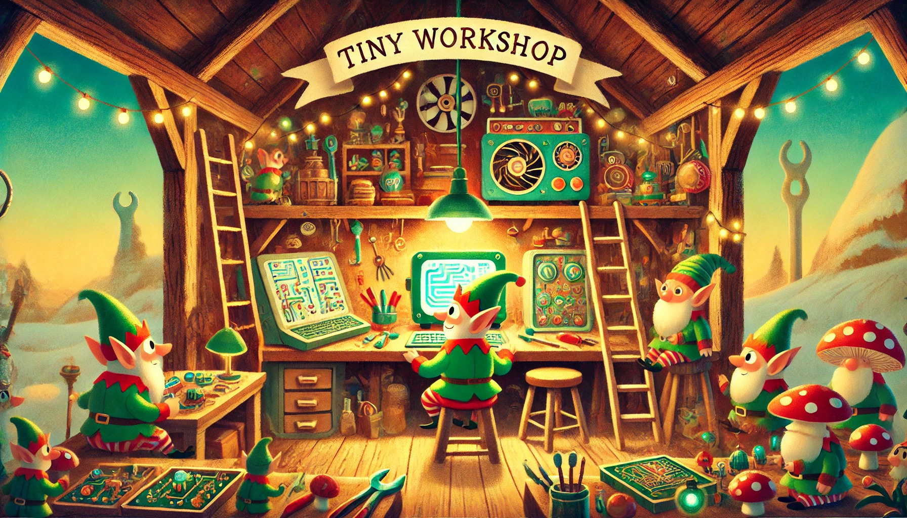

<div align="center">
  
# Tiny Workshop
Fine-tuning of Whisper Models on Edge Device CPUs
</div>
<p align="center">
   

</p>
<br />


## TODO
- [x] requirements.txt!
- [x] python environment 
- [x] cookie cutter file format
- [x] setup instructions, 
- [ ] data information, download data instructions, etc
- [ ] notebooks for testing, %autoreload
- [ ] models folder: predictions, training log, model config, eval stats
- [ ] fnpg command line for manipulating audio and video, installable wiht python with mamba
- [ ] make svg figures first, then convert to png. inkscape
- [ ] create a figure (first figure in paper) for description of problem: local fine-tuning instead of cloud based
- [ ] create a figure (second figure in paper) for decription of methodology: partial-fine-tuning, adatptor, lora, etc.

## Setup
We set up a virtual environment using conda, and our code is developed in Python 3.12.

```bash
# Cloning the repository
git clone https://github.com/derpysquid10/tiny_workshop.git

cd tiny_workshop

# Setting up environment and installing libraries
conda env create -f environment.yml
conda activate tiny-workshop
pip3 install torch torchvision torchaudio --index-url https://download.pytorch.org/whl/cpu  # We want the CPU version of pytorch
pip install -r requirements.txt
pip install peft
```

## Running Tiny Workshop

### Loading the Dataset
First, we have to load the Afrispeech-200 dataset
```bash
python tiny_workshop/data_processing.py --process-data
```

### Baseline Tests
Now, we can run our baseline fine-tuning tests on a CPU and GPU:
```bash
# for CPU
python tiny_workshop/experiments/baseline_finetune_cpu.py 

# for GPU
python tiny_workshop/experiments/baseline_finetune_gpu.py
```

If an error ```version `GLIBCXX_3.4.30' not found``` is encountered, run ```conda install -c conda-forge libstdcxx-ng=12``` and re-run the baseline tests.


### Fine-tuning Experiments
Here, we can experiment fune-tuning with LoRA, additive fine-tuning, and partial fine-tuning:

#### LoRA
:construction::construction: Currently in progress :construction::construction:
```bash
```

#### Additive Fine-tuning
:construction::construction: Currently in progress :construction::construction:
```bash
```

#### Partial Fine-tuning
```bash
# Fine-tuning the encoder
python tiny_workshop/experiments/finetune_encode_LL.py

# Fine-tuning the decoder
python tiny_workshop/experiments/finetune_decode_LL.py

# Fine-tuning the encoder and decoder
python partial: tiny_workshop/experiments/finetune_both_LL.p
```


